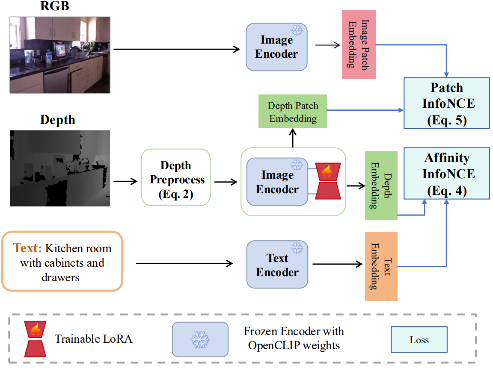

# DepthCLIP3D: A Unified Approach for 3D Visual Understanding with Depth

**📄 Paper:** _DepthCLIP3D: A Unified Approach for 3D Visual Understanding with Depth_  
Xinyi He, Yuanyuan Ran, Xiangyu Xu  

📌 This paper has been accepted to ICASSP 2026.

## 📝 Abstract
  We introduce DepthCLIP3D, a unified framework designed to tackle a range of open-domain monocular 3D vision tasks, including classification, segmentation, and multi-modal identification. Our core insight is that these diverse tasks can be efficiently handled using a single architecture by integrating the CLIP model with depth maps. Unlike existing approaches that are based on point clouds, depth maps provide a regular grid structure that is well-suited for monocular inputs, allowing the effective use of advanced neural networks such as CNN or ViT. We have developed several best practices into DepthCLIP3D, significantly enhancing its performance and generalization capabilities. Through extensive experiments, we demonstrate that our approach consistently outperforms existing state-of-the-art methods across multiple tasks.

  > 🔓 **Code and models will be released after the official publication of the paper.**
